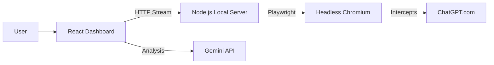

# 🕵️‍♂️ ChatGPT SEO Interceptor


> **Stop guessing what AI thinks. Start seeing what AI searches.**

## 🚀 The Mission: Reverse-Engineering "Search Grounding"

Traditional SEO tools (Ahrefs, SEMrush) tell you what humans type into Google. They **cannot** tell you what ChatGPT types into Bing/Search when it needs to verify facts.

As search behavior shifts from "Ten Blue Links" to "AI Answers," optimizing for LLMs (Generative Engine Optimization - GEO) is critical. 

**The ChatGPT SEO Interceptor** reveals the black box. It automates a headless browser, acts as you, asks ChatGPT a question, and **intercepts the internal network traffic** to capture the exact search queries the model sends to the web.

It then uses **Google Gemini 1.5** to analyze those queries and build a content strategy that fills the specific information gaps the AI is looking for.

---

## ✨ Key Features

-   **Real-Time Network Sniffing**: Uses Playwright to hook into `page.on('response')` and parse the streaming JSON from `/backend-api/conversation`.
-   **Session Injection**: Bypasses the login screen by injecting your `__Secure-next-auth.session-token` cookie directly into the headless browser context.
-   **Automated Interaction**: Types prompts and handles the UI interaction automatically using `puppeteer-extra-plugin-stealth` to avoid bot detection.
-   **AI-Powered Strategy**: Sends the intercepted queries to Gemini 1.5 Flash to generate a "Gap Analysis" content outline.
-   **Local & Private**: Your session token and data never leave your local machine/browser. The automation server runs on `localhost`.

---

## 🛠️ Architecture

This is a **Hybrid Application** consisting of two parts:

1.  **Local Automation Server (`server.js`)**: A Node.js/Express server that controls the Headless Chrome instance. It handles the "dirty work" of scraping and network interception.
2.  **React Dashboard (`App.tsx`)**: A modern UI that connects to the local server, visualizes the logs, and interfaces with the Gemini API for strategy generation.



---

## ⚡ Quick Start

### Prerequisites
- Node.js (v18+)
- A Google Gemini API Key
- A ChatGPT Plus/Team/Enterprise account (Standard accounts work, but "Search" triggers less often).

### 1. Install & Start Backend (The Interceptor)
Open a terminal in the project root:

```bash
# Install backend dependencies
npm install express cors playwright playwright-extra puppeteer-extra-plugin-stealth

# Install Playwright browsers
npx playwright install chromium

# Start the local automation server
node server.js
```
*You should see: "Local Automation Server running on http://localhost:3001"*

### 2. Start Frontend (The Dashboard)
Open a **new** terminal window:

```bash
# Install frontend dependencies
npm install

# Start the application
npm start
```

### 3. How to get your Session Token
To automate the browser as *you*, the app needs your session cookie.
1. Go to [chatgpt.com](https://chatgpt.com) and log in.
2. Press `F12` to open Developer Tools.
3. Go to the **Application** tab -> **Cookies** -> `https://chatgpt.com`.
4. Find the cookie named `__Secure-next-auth.session-token`.
5. Copy its value (it starts with `eyJ...`).

---

## 🧠 Why This Matters for SEO

When you ask ChatGPT "Best running shoes for flat feet," it doesn't just guess. It performs **Retrieval Augmented Generation (RAG)**. It searches the web.

If ChatGPT searches for:
1. *"Brooks Adrenaline GTS 23 review runner's world"*
2. *"Running shoes flat feet reddit discussion"*

...and you are writing a generic blog post, **you will be ignored**.

This tool tells you that the AI trusts *Runner's World* and *Reddit* for this topic. To rank in the AI answer, you need to:
1. Get mentioned on Reddit threads.
2. Structure your content to match the technical depth of Runner's World.

**This is the future of SEO.**

---

## ⚠️ Disclaimer

This tool is for **educational and research purposes only**.
-   Automating user accounts may violate OpenAI's Terms of Service.
-   Use responsibly. Do not use this for large-scale scraping or abusive request patterns.
-   This tool works by automating a local Chrome instance; it is not a "hack" of OpenAI servers, but a client-side automation tool.

---

## 💻 Tech Stack

-   **Frontend**: React 19, Tailwind CSS, Lucide Icons.
-   **Backend**: Node.js, Express (Streaming Responses).
-   **Automation**: Playwright, Puppeteer Stealth.
-   **AI**: Google Gemini 1.5 Flash (via `@google/genai`).
